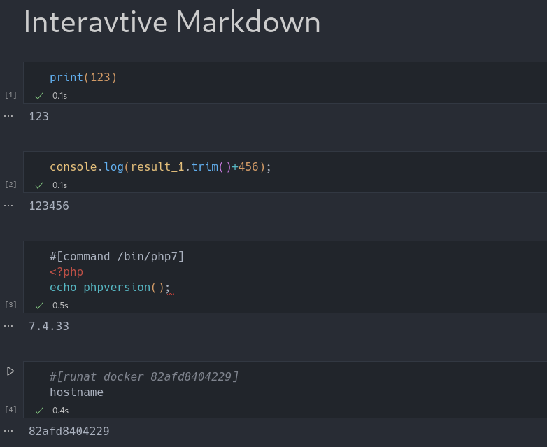

# Interactive Markdown

这是一个VS Code扩展，提供了交互式操作的Markdown Notebook。可用于创建工作流，保存工作进度，为笔记提供一定的自动化扩展。



## 功能

- 提供了四种脚本语言的执行：Python, Javascript(Node), PHP, Shell
- 可从Markdown文件中保存或读取执行结果
- 代码块的执行结果可共享
- 支持JSON格式的自动反序列化

## 使用

- 下载扩展的vsix并安装（早期阶段未上架商店）
- 打开一个markdown，右键文件名打开菜单，选择`重新打开编辑器的方式`
- 选择使用`Interactive Markdown`打开

## 原理

共享的代码执行结果会以常量定义（如果语言支持的话）的形式插入到生成的代码文件开头，并做一次base64解码，例如javascript的实现：
```js
contextValue.forEach((v, k) => {
    const label = resultLabel + String(k);
    if (typeof v === 'string') {
        const t = Buffer.from(v).toString('base64');
        code += `const ${label} = Buffer.from('${t}', 'base64').toString();\n`;
    }
});
```

常量名前缀由`interactive-markdown.resultLabel`设置，序号为代码块的编号。如果输出包含json和text两种格式，则优先保存json。如果多次输出json，则优先保存第一个。

## 配置

- interactive-markdown.executors
配置脚本语言的执行器路径和参数，`%p`代表生成的代码路径

- interactive-markdown.resultLabel
共享执行结果的变量名前缀

## 感谢

https://github.com/microsoft/vscode-markdown-notebook
